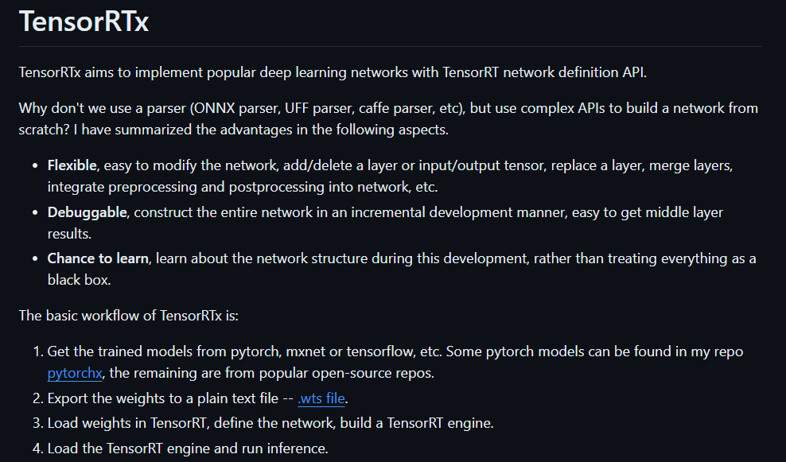

# TensorRT :100:

## TensorRT Note

### 1. 简介
NVIDIA TensorRT™ 是用于高性能深度学习推理的 SDK。此 SDK 包含深度学习推理优化器和运行时环境，可为深度学习推理应用提供低延迟和高吞吐量。在推理过程中，基于 TensorRT 的应用程序的执行速度可比 CPU 平台的速度快 40 倍。借助 TensorRT，可以优化在所有主要框架中训练的神经网络模型，精确校正低精度，并最终将模型部署到超大规模数据中心、嵌入式或汽车产品平台中。TensorRT 以 NVIDIA 的并行编程模型 CUDA 为基础构建而成，可利用 CUDA-X 中的库、开发工具和技术，针对人工智能、自主机器、高性能计算和图形优化所有深度学习框架中的推理。TensorRT 针对多种深度学习推理应用的生产部署提供 INT8 和 FP16 优化，例如视频流式传输、语音识别、推荐和自然语言处理。推理精度降低后可显著减少应用延迟，这恰巧满足了许多实时服务、自动和嵌入式应用的要求。

TensorRT 优化与性能：

- 权重与激活精度校准： 通过将模型量化为 INT8 来更大限度地提高吞吐量，同时保持高准确度；
- 层与张量融合： 通过融合内核中的节点，优化 GPU 显存和带宽的使用；
- 内核自动调整： 基于目标 GPU 平台选择最佳数据层和算法；
- 动态张量显存： 更大限度减少显存占用，并高效地为张量重复利用内存；
- 多流执行：     用于并行处理多个输入流的可扩展设计。

### 2. 基础使用

- 1> [实现一个最简单的神经网络](https://github.com/cvdong/TensorRT_dong/blob/main/src/base_src_1.cpp)
- 2> [模型生成和推理](https://github.com/cvdong/TensorRT_dong/blob/main/src/base_src_2.cpp)
- 3> [动态shape推理](https://github.com/cvdong/TensorRT_dong/blob/main/src/base_src_3.cpp)
- 4> [onnx解析与build](https://github.com/cvdong/TensorRT_dong/blob/main/src/base_src_4.cpp)
- 5> [onnx源码解析](https://github.com/cvdong/TensorRT_dong/blob/main/src/base_src_5.cpp)
- 6> [onnx-trt插件实现编译推理](https://github.com/cvdong/TensorRT_dong/tree/main/src/onnx-plugin)
- 7> [onnx-trt插件封装实现](https://github.com/cvdong/TensorRT_dong/tree/main/src/onnx-package-plugin)
- 8> [onnx-trt更多插件实现](https://github.com/cvdong/TensorRT_dong/tree/main/src/onnx-package-plugin-2)
- 9> [trt ptq int8量化](https://github.com/cvdong/TensorRT_dong/blob/main/src/base_src_6.cpp)
- 10> [trt int8量化思考](https://github.com/cvdong/TensorRT_dong/blob/main/src/%E9%87%8F%E5%8C%96%E6%B5%81%E7%A8%8B%E4%BB%A5%E5%8F%8Aint8%20plugin.txt)

**TRT api 搭建模型 参考**：
[https://github.com/wang-xinyu/tensorrtx/tree/master](https://github.com/wang-xinyu/tensorrtx/tree/master)

---

**ONNX -> Engine 搭建模型 参考**：
[https://github.com/shouxieai/tensorRT_Pro](https://github.com/shouxieai/tensorRT_Pro)

### 3. 进阶使用
- 11> [trt resnet 18 build->infer流程](https://github.com/cvdong/TensorRT_dong/blob/main/src/base_src_7.cpp)
- 12> [trt yolov5 build->infer流程](https://github.com/cvdong/TensorRT_dong/blob/main/src/base_src_8.cpp)

不定时更新，记得star，哦哦！

